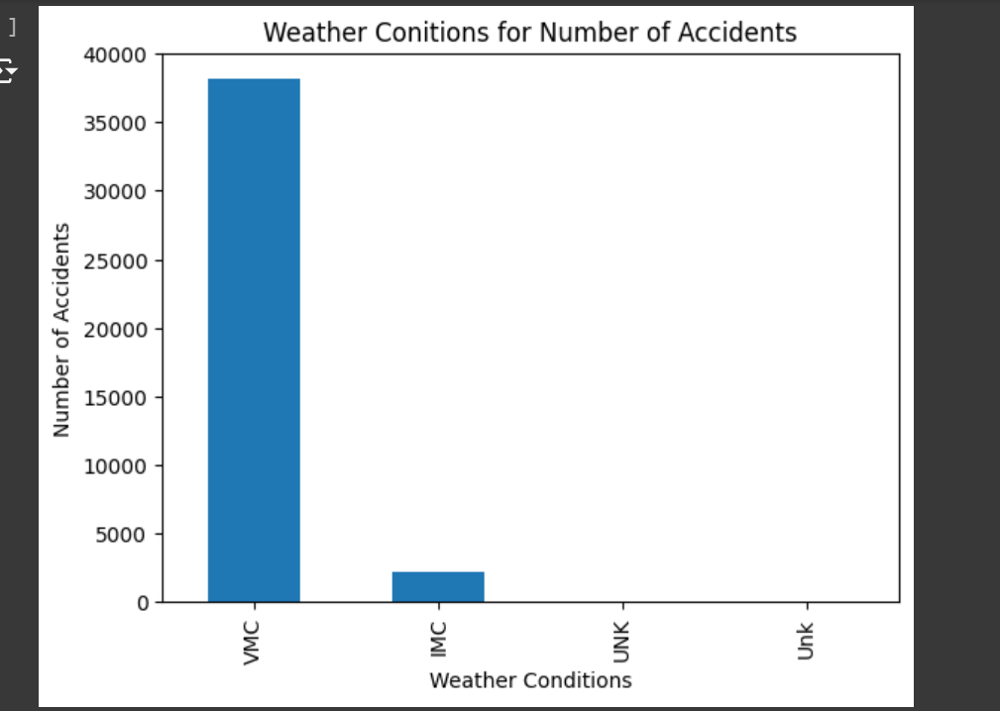

# Aviation Analysis project in choosing a low risk aircraft
## Background
Air transport has become the most popular means of transport across the world.
It is the fastest means of transport and the most safest means of transport.
Although air transport can be deemed as the fastest means of transport, it is also one of the most expensive means of transport that generates a lot of money to many airlines.
Aviation has become very wide spread and quite popular as it connects distant regions promoting tourism, international trade, cultural exchange and promoting businesses globally. 
## Business problem
Over the years air transport has faced many challenges such as plane crashes that has led to fatal injuries and serious injuries inflicted on passengers and cargo destruction.
Plane accidents have also occurred causing either minor or serious injuries to passengers. This accidents can be caused by bad weather conditions.
## Business solution
To avoid such challenges or risks when purchasing an airplane, first the buyers need to identify the make and model of the plane they want to buy.  This can be done by conducting analysis on the impact the make and model has made on the passengers throughout the years. This can be the fatal injuries, serious injuries and minor injuries inflicted on the passengers by the make and model of the planes.  
## Data analysis
For this project, to conduct data analysis some steps have to be taken:
Collect data needed for this project by identifying a dataset that is relevant to the project been conducted. For this project the dataset identified was the aviation dataset from Kaggle which contained 25 columns and 10,000 plus rows.
The dataset consists of categorical and continuous columns. The categorical column consists of make, model, broad phase of flight, purpose of flight and weather conditions. The continuous columns include total fatal injuries, total serious injuries, total minor injuries and total uninjured.
### The visualizations created include

## Tableau Dashboard link
https://public.tableau.com/app/profile/natalie.akeyo/viz/project_1_17182819892450/Dashboard2?publish=yes
## Conclusion
From the data analysis done, I would recommend the buyers to adhere to the safety of passengers by making them first priority.
This can be done by choosing plane makes that over the years have had less fatal and serious inflicted injuries on the passengers.
Another way is by understanding why many accidents occur during takeoff and approach and why do many accidents occur during personal purpose flights. This can be done by seeking further information from aviation specialists.

